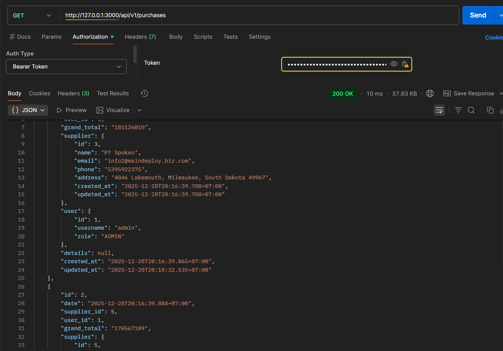

# Simple Procurement API

**Simple Procurement API (Application Programming Interface)** adalah antarmuka pemrograman aplikasi yang dirancang untuk mengelola proses pengadaan barang secara sederhana.
 
Project ini dirancang dan dibangun menggunakan bahasa pemograman **GO (Golang)** dengan **Fiber Framework**. dengan struktur yang rapi, scalable, dan mengikuti praktik industri.

Tujuan aplikasi ini adalah mendemonstrasikan alur dasar sistem procurement.

---

## Fitur Utama

- Autentikasi & Autorisasi (JWT)
- Login / Logout / Register pengguna
- Manajemen User
- CRUD Suppliers (Manajemen Supplier)
- CRUD Items (Manajemen barang)
- Proses Purchasing (Pembelian)
- Stock Movement (Masuk & Keluar)
- Seeder & Migration Database
- Middleware JWT
- Validasi Request
- Struktur API siap produksi

---

## Teknologi

- **Backend:** Golang, Fiber Framework, GORM (ORM)
- **Database:** MySQL / MariaDB
- **API:** RESTful
- **Tools:**, Go Modules

---

## Struktur Project

```
procurement-api:
|   .env
|   .env.example
|   .gitignore
|   go.mod
|   go.sum
|   main.go
|   README.md
|   structure.txt
|   
+---.idea
|       .gitignore
|       go.imports.xml
|       modules.xml
|       procurement-api.iml
|       workspace.xml
|       
+---cmd
|   \---seed
|           main.go
|           
+---config
|       database.go
|       jwt.go
|       
+---controllers
|       auth_controller.go
|       item_controller.go
|       purchasing_controller.go
|       supplier_controller.go
|       
+---database
|   +---migrations
|   |       000001_create_users_table.down.sql
|   |       000001_create_users_table.up.sql
|   |       000002_create_items_table.down.sql
|   |       000002_create_items_table.up.sql
|   |       
|   \---seeders
|           item_seeder.go
|           purchasing_detail_seeder.go
|           purchasing_seeder.go
|           stock_movement_seeder.go
|           supplier_seeder.go
|           token_blacklist_seeder.go
|           user_seeder.go
|           
+---middlewares
|       jwt_middleware.go
|       
+---models
|       item.go
|       purchasing.go
|       purchasing_detail.go
|       stock_movement.go
|       supplier.go
|       token_blacklist.go
|       user.go
|       
+---requests
|       auth_request.go
|       item_request.go
|       purchase_request.go
|       supplier_request.go
|       
+---routes
|       auth_routes.go
|       item_routes.go
|       purchasing_routes.go
|       routes.go
|       supplier_routes.go
|       
\---utils
        password.go
        response.go
        stock.go
        validator.go
        webhook.go
```

---

## Instalasi & Menjalankan Aplikasi

### Backend Golang

1. Pastikan Golang sudah terinstall.
2. Masuk ke folder backend:
3. Salin file `.env.example` menjadi `.env`
```bash
APP_ENV=development
APP_PORT=3000

DB_HOST=localhost
DB_USER=database_user
DB_PASS=database_password
DB_NAME=database_name
DB_PORT=3306

JWT_SECRET=ContohBahrudinArdiansyah
```

> Sesuaikan Env, Port, Database dan Secret JWT yang digunakan


```bash
cd procurement-api
go mod tidy
go run main.go
```
4. Backend akan berjalan di `http://localhost:3000`.


### Migrasi Database & Seeder (Opsional)

- Migrasi database berada di folder `backend/migrations`.
- Seeder data dummy berada di folder `backend/seeders`.
- Pastikan file `.env` dikonfigurasi dengan benar, contoh:
```
DB_HOST=localhost
DB_PORT=3306
DB_USER=root
DB_PASSWORD=root
DB_NAME=procurement_db
```
```bash
cd procurement-api
go run cmd/main.go
```
---

## Routing & URL

### Format URL
```
https://api.domain.com/api/resource
https://api.domain.com/api/v1/resource
```


### Backend API
| URL API Backend         | Fungsi              |
|-------------------------|---------------------|
| `/api/v1/auth/register` | Pengguna register   |
| `/api/v1/auth/login`    | Pengguna login      |
| `/api/v1/auth/logout`   | Pengguna keluar     |
| `/api/v1/items`         | List semua items    |
| `/api/v1/suppliers`     | List semua suppliers |
| `/api/v1/purchases`     | List semua pembelian|

---

## Diagram Alur Procurement

```
Supplier --> Procurement --> Items --> Stock Update
Users <--> Dashboard Frontend <--> Backend API <--> Database
```


---

## Screenshots Postman 




---


## Frontend 

Repositry https://github.com/bahrudin/basic-procurement-frontend

## Tujuan Penggunaan

- Prototype Sistem Procurement
- Pembelajaran ERP / Inventory
- Contoh Backend + Golang Fiber
- Project Portofolio

## Lisensi

MIT License © 2025 Bahrudin Ardiansyah  
Proyek ini sebagai portofolio bersifat open-source dan bebas digunakan untuk keperluan pembelajaran dan pengembangan
